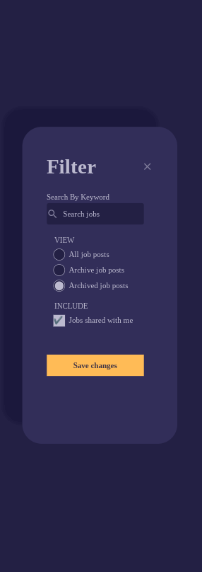

<h1 align="center">UI Design Daily - #1569 Filter Modal</h1>

## Overview

  
UI Design Daily design translated to real code.  I was going to make a central repo for any UI Design Daily designs I converted but I do not know how many I will do (etc) so I will just preface any ui-design-daily repos with ui.   

Design is responsive but not totally perfect.  

## Useful Resources

- [FaviconGrabber](https://favicongrabber.com)
- [Stack Overflow](https://stackoverflow.com/questions/36018844/box-shadow-top-and-left-only)  - box shadow
- [Blog](https://www.a11ywithlindsey.com/blog/create-custom-keyboard-accessible-radio-buttons)  - accessible radio btns
- [Stack Overflow](https://stackoverflow.com/questions/3072597/semantically-accurate-html5-element-for-a-modal-dialog) - dialog tag